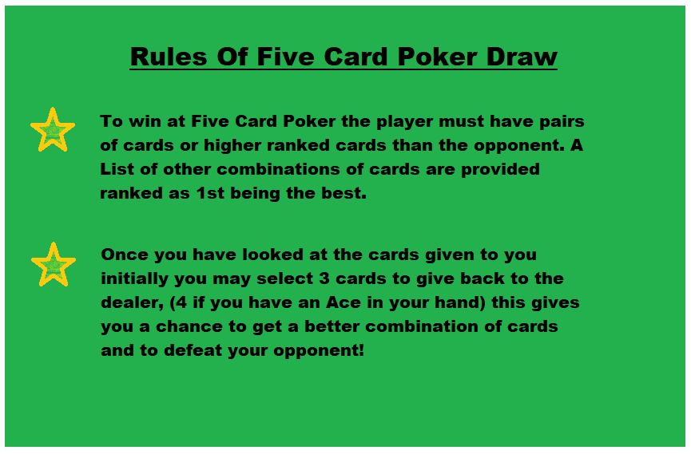
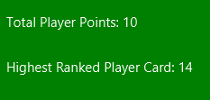
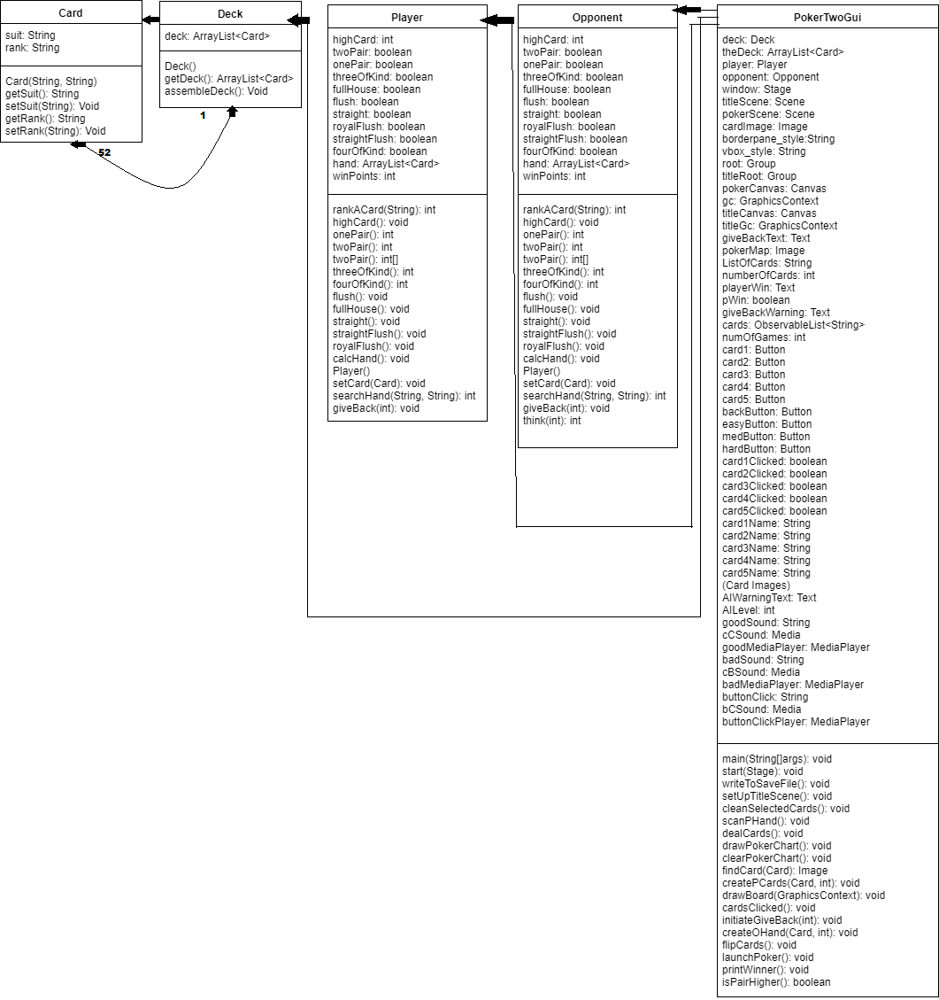
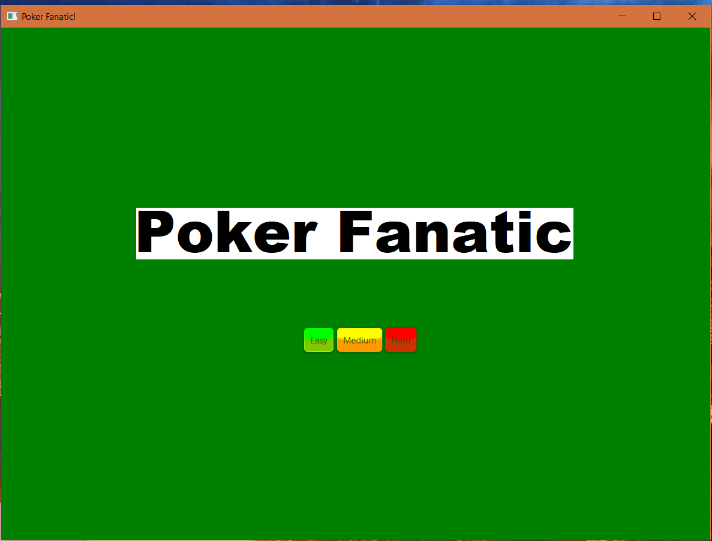
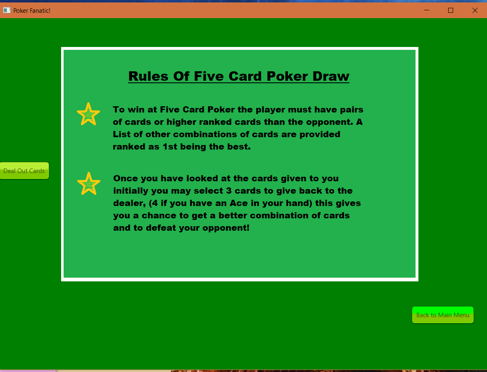
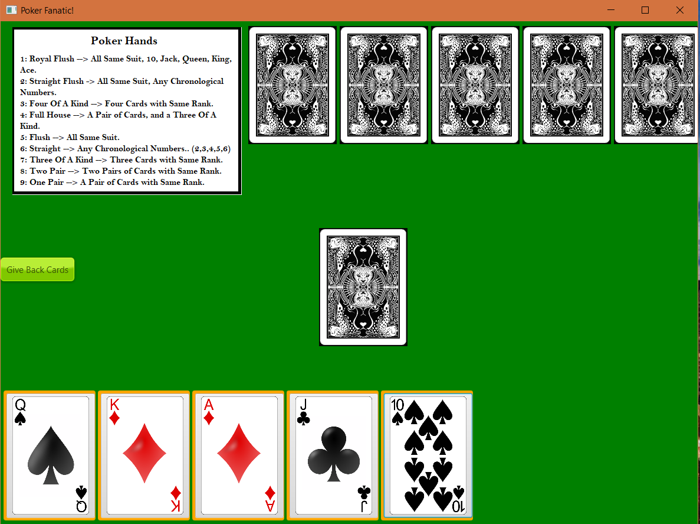
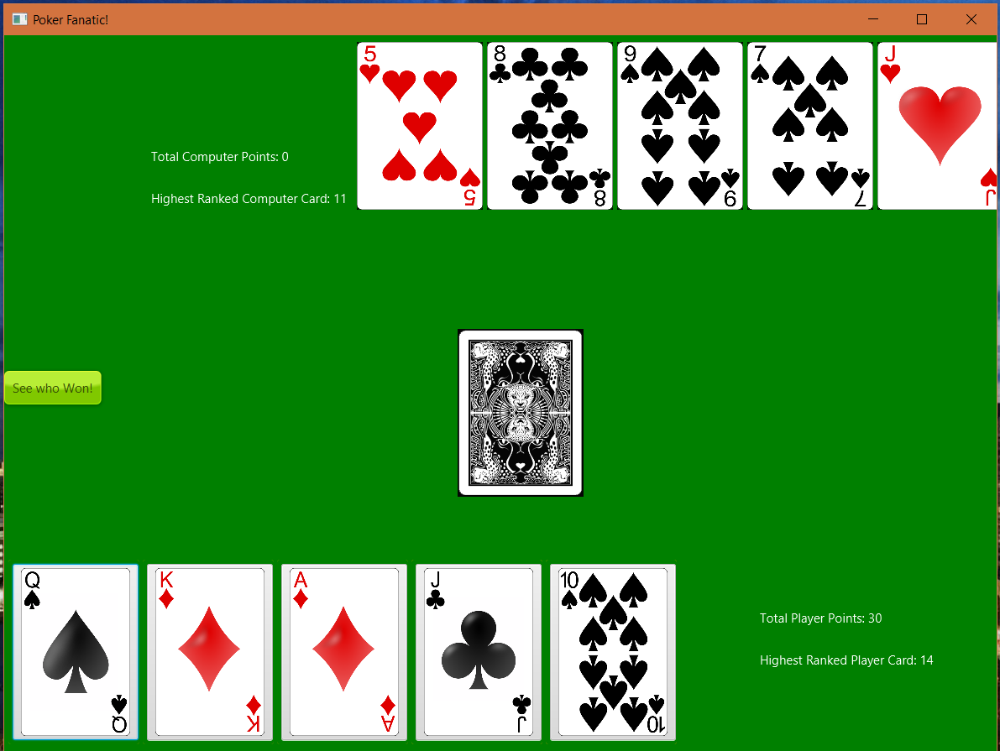
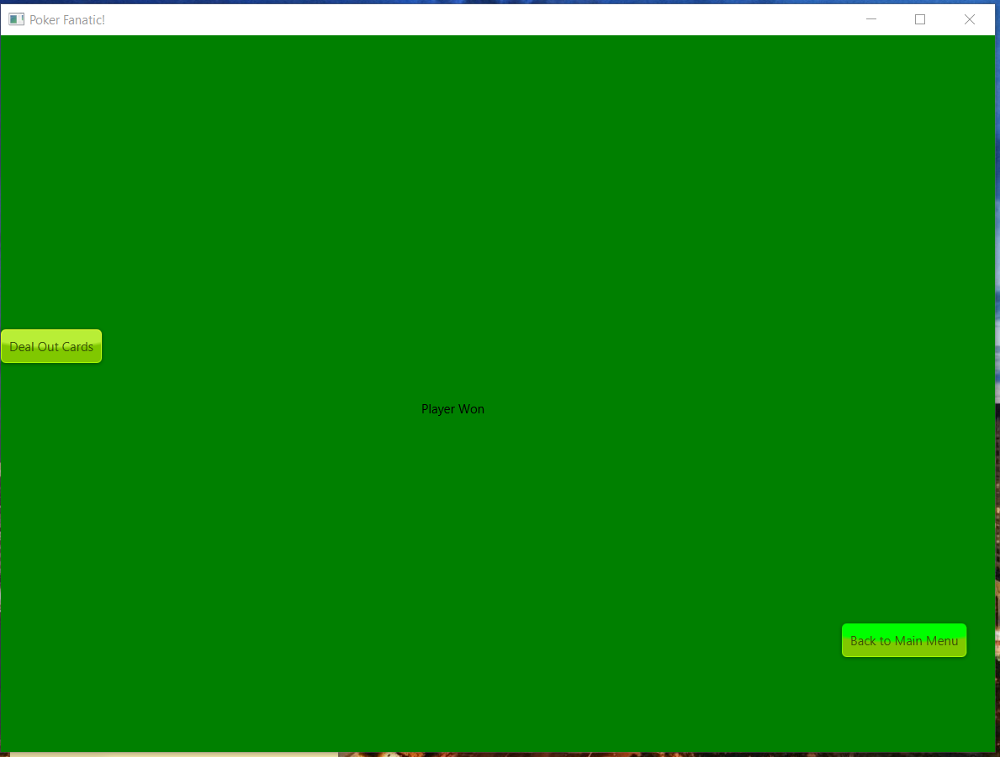

# Poker Fanatic!
## Maximilian Finnican
## 4-18-2018
---
# Abstract

&emsp;The overall objective of Poker Fanatic (PF) is to have a desktop application that can run a game of Five Card Poker against an intelligent AI to teach users strategies and basics of five card poker draw. The project consists of multiple classes and utilizes the JavaFx library to create a standalone application. All the code is written within eclipse oxygen, an IDE that I prefer because of its helpful auto fill options, vast library collections for java, and its debug mode. When developing PF, I first began by creating the deck of cards, using an array List I was able to create a list of 52 “Card” objects to be contained inside my Deck Class. Then I added the player class and opponent class, so it could interact with the deck. Using JavaFx I then was able to create an environment for the player and opponent to play against each other.  
&emsp;	The product that has been developed now has a list of features: Adjustable Opponent (easy, medium, hard), A graphic containing instructions on how to play poker, a graphic containing a ranked list of poker hand combinations, results post due to the points earned by the player and opponent, clickable cards with a nice highlight to see cards clicked, and fun sounds that help navigate and determine results of game. Users can launch the game, choosing the level of difficulty of the computer, deal out cards, make educated decision on cards to give back, and then see their results on the next page. If the user is satisfied with the level of difficulty they can continue to play if not there is an option to go back to the main page in order to change the computers difficulty. 
Keywords: Java, JavaFx, Eclipse, AI, Card Games.

---

# Table of Contents

1. [Abstract](#abstract)
2. [Introduction and Project Overview](#introProOv)
	1. [Problem, Objectives, Users](#pou)
	2. [Background Information](#backgroundInfo)
	3. [Features](#features)
3. [Design, Development, and Test](#ddt)
	1. [Design](#design)
	2. [Development](#dev)
	3. [Testing](#test)
4. [Results](#result)
5. [Conclusion](#conclusion)
6. [References](#ref)
 

---

# Introduction and Project Overview

&emsp;When I was little my grandpa taught me how to play five card poker draws. As I got older my grandfather is no longer with us, but now I have little cousins who do not know how to play Poker! Kids these days are so infatuated with technology I felt if there was one way to teach them how to play poker then it would have to be from the computer. Poker Fanatic is the attempt to create an educational poker game to try and help people learn how to play poker from the comfort of their computer. 

## Problem

&emsp;When people are learning how to play poker the most basic thing to understand is the actual rules of the game. Because there are many combinations of cards inside the game, people tend to not know them all. You need to inform the user that all the cards have different “values”. When looking at an “Ace” vs a “2” in rank they are very different because of the value associated with the card’s rank. An Ace can be counted as 1 or 14, in the case of five card poker draw, PF has Ace programmed as 14 always, although the 2 is always counted as 2. To win in poker the user must know about the effect of having higher ranked cards, meaning if the player has an ace and the opponent has a 2 the player would win, and the opponent would lose. There are also many combinations of cards, flushes, straights, three of kind, pair, royal flush, and etc. All these combinations deal with the cards in the user hand and if they have same suit, are consecutive in ranks, or a combination of both. The ranking of these combinations are based off the rarity of the combination. When poker was created these rarities were decided, creating a ranked order causing other card combinations to be greater than others. The user needs a list of those hand combinations in a ranked order. Once the user knows how to play and what to look for it only takes practice and my goal will have been satistfied.

 

 
<strong>Fig 1</strong> 
 

<strong>Fig 2</strong>

## Objectives

&emsp;Poker Fanatic is meant to teach someone how to become good at poker. What I wanted to have available for the user is easy ways to start the game, adjustable versions of the game so the user can start at their level of expertise, and feedback to show them what they got based off the combination of cards in their hand. I wanted an intuitive design so that is why when you run the game you immediately know what to do, to solve this the user is prompted with three buttons reading “easy”, “medium”, and “hard” which are also colored green yellow and red for visual ques. When clicked the rules of poker are displayed and a button that says, “deal out cards”. Hopefully by this point the user understands the basics of the game and continues to deal out the cards. Now the user has a bunch of cards and is not sure what to do, so a map of poker hand rankings is displayed to help aid the user’s decisions with what cards to give away. Once you have given back your cards points will be evaluated for your final hand and printed after you flip the opponents hand.  This was implemented to help see the rank of their hand on the ranking list. 

<strong>Fig 3</strong>

## Users

&emsp;Users of Poker Fanatic would be younger kids, or young adults. This is because most of the elder generations have played poker before and usually prefer using standard cards rather than a computer program.

## Relevant background information

&emsp;Other types of poker apps exist out on the market but not many are focused in on teaching the user how to play the game. Most other versions have gambling aspects with real currencies, multiplayer, and customizable avatars. This adds more fun to the game for the user, but these games are not as educational as poker fanatic.

## Problem Scope

&emsp; My problem scope is will the user be able to start up the application and make educated decisions about his/her moves when prompted to give back cards.

## Summary of Features
<a name="features">

| Features|
|----------|
|Adjustable Opponent|
|Adjustable backgrounds and colors|
|Poker hand ranking chart|
|Sounds and Music|
|Card Images|
|Clickable cards to give back|
|Show points earned for poker hand|
|Customizable winning graphics|
|Animation of Cards|

# Design, Development, and Testing
 

## Design
<a name="design">

&emsp;How I designed Poker Fanatic was with the mentality of “starting from scratch”. As practice to become a better programmer I began just to code what all was needed to create a card game in the real world. First being the cards, then a deck, then a player to play with the deck of cards. At first the game was running from command line but eventually I used javaFx’s application software to write a decent GUI for the game. Here is a UML diagram of Poker Fanatic. 

<strong>Fig. 4.</strong>

Because I needed to keep track of what combination of cards a player or opponent had I created global variable Booleans for the player and opponent class to keep track of what they have in their hands. At the end of the game a method is called to run all the methods to test for those combinations then a certain amount of winPoints are awarded depending on the players hand. Designing the Gui was tricky but I was able to make the cards into buttons, that way I could use built in javafx functions to handle the events of a mouse click, which also allowed me to color selected cards giving a “highlighted” feel. When I designed the buttons, I tried to have a detailed caption on the button so that the user would know what is happening when they clicked the button. For better looks and feels I added sounds to the clicks of buttons and css styling that shows the button press in when they are clicked.

## Development

&emsp;Early stages of development include many stages, the first was to have the deck working properly. My first questions I asked myself for testing was: did the deck assemble correctly, when shuffled is it truly randomized, when cards are taken out there are no duplicates, when cards are taken out the size of the deck goes down. So, to test this I created a player class with an array list as the hand and began to write code to make all this possible. Once I was able to correctly give players cards that is when I decided to keep track of what was in the players hand. I created Booleans to keep track of different card combinations, then a master method called calcHand to enact all the methods that checked for the different hand types. Once I had this working properly I was able to create an opponent to play against, because calcHand was made and win points were given to each player it made deciding who won the match easy to code. Then ultimately once the game worked perfectly in command line I implemented all of it in a Gui. Designing and programming the interface dealt with cosmetic changes to the screen, therefore the methods created were all to aid that process to make it as organized as possible. The start(Stage) method is inherited from the Application class from the JavaFx packages. This allows the user to begin programming to an Application that is pre-generated from the java library. To begin coding to the application one must “set the scene with a stage”, the stage can be thought of as the application window or the box with the minimize, expand, and close options, and the scene can be thought of as what you see inside the window. To create poker fanatic I created two scenes, one for a title of the game and to adjust the AI settings, and the other to play the game of poker in. this helps with an easy transition for the user to choose his/her difficulty and to play the game.

## Testing

&emsp;To Test Poker Fanatic, I created multiple test classes that tested the global variables and methods of each class outside of the Gui. This way if there were any bugs inside the game’s engine I could easily debug it by running the test classes. Test classes were made for the Card class, Deck class, Player class, and Opponent class. When you run the test classes it will print to command line all the methods that its testing along with a description of the test plus the result. As far as testing the Gui I was unable to use any de bugger for JavaFx, although I made visual checks when running the program to make sure everything was appearing as intended. One problem I ran into for testing was the findCard(Card) method which helps find the correct image for the card that is being shown on the poker stage, because I hand wrote all the names of the image files some had some misspellings, to ensure I found all faulty spellings I played 100’s of games with the card names of the opponent and player printed to the console so I could find any mis-matches. I also created a test class to have a sandbox program from finding out which buttons were clicked by the user called testClickedCard.

# Results

&emsp;My Results were successful in creating a poker app that could help a user learn how to play five card pokers. When a user fails or succeeds against my computer a sound is played either a crowd cheering or a crowd booing for added entertainment [2]. People claim to like the feel of Poker Fanatic as well as the speed it runs. Problems I ran into was mostly my fault by forgetting to make sure if a user had a pair, but their pair was a higher ranked pair then that person would win the poker match. I overcame this obstacle and even added in notes on the winning screen to let a player know if they lost or won with higher ranked cards. The buttons clicking through the game are very addictive they make a little noise when clicked and everything loads very fast. When you are facing the opponent and you select easy mode there are distinct differences when compared to medium and hard mode. To test this, I ran a simulation of 25 games each: 

<strong> Fig 5 </strong>

&emsp;From my results you can see easy mode is has the lowest scores, medium increases a bit, and hard gets “bust” just under 30% of the time where as easy mode gets a “bust” almost 50% of the time. The fact that its so random to get these combination of cards makes it difficult to create an AI that always gets a good set of cards. I was able to have card images that acted as buttons to perform all the functionalities that I needed them to do [3]. Here is a table of features I had intended to do and a summary of them.

|Feature|Implemented|Not Implemented|
|---|---|---|
|Adjustable Opponent| X | |
|Poker Rules Map| X | |
|Adjustable Backgrounds and Colors| | X |
|Poker Hand Ranking Chart| X | |
|Sounds and Music| X | X |
|Card Images| X | |
|Clickable Cards to give back| X | |
|Show points earned for poker hand| X | |
|Cutomizable winning graphics| | X |
|Animation of Cards| | X |

 
&emsp;Now I will demonstrate the visuals of Poker Fanatic when run and give a couple of pictures depicting the user experience when using the program. First photo shows the title screen, next shows poker rules map, next is highlighted cards, next is win points being displayed, and the last photo is the win screen showing who won the match. 

<strong> Fig 6 </strong>

<strong> Fig 7 </strong>

<strong> Fig 8 </strong>

<strong> Fig 9 </strong>

<strong> Fig 10 </strong>

# Conclusion and Future Work

&emsp;The challenge was to create a program that could help teach people how to play poker. I took on the mindset that the users were young so that it was readable to all skill levels. In the end the product is intuitive and helps the user progress from easier challenges to harder ones. Lessons that I have learned throughout this project is to plan, writing down programs and features helped me visualize its implementation thus leading to a lot of time saved writing code. In the early developments of the project I wasn’t as organized when compared to the end of the projects lifecycle. Clustering random code into organized methods also helps a lot with reading code. I could see future work including adding a betting system, I defiantly left room for this by adding phases in the button clicks. I would also like to include a high score list, so a user could know he/her highest card combination and keep track of how much money they were able to make betting. Adding animation would have made the game a lot more fun as well, from having the cards actually dealt out to the player and opponent to giving back cards and simulating that with animations. If I were to develop this a different way I would have tried to use scene builder with javaFx, this is a tool that helps build apps.

<a name="ref">
# References
[1] Button Css Styling: http://fxexperience.com/2011/12/styling-fx-buttons-with-css/
[2] Button / Crowd Cheering and Booing Sounds: http://soundbible.com/tags-button.html
[3] Card Art: http://byonknoll.blogspot.com/2011/03/vector-playing-cards.html
[4] Poker Title, Game Help Image, Poker Hand Ranking Image: Maximilian Finnican. (Paint)
