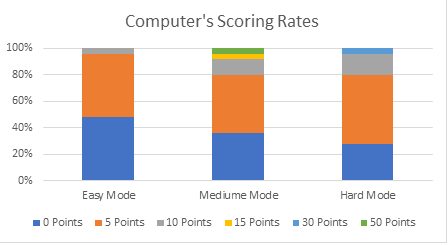

# Poker Fanatic!
# Maximilian Finnican
# 4-18-2018

---

# Abstract

&emsp; The overall objective of Poker Fanatic (PF) is to have a desktop application that can run a game of Five Card Poker against an intelligent AI to teach users strategies and basics of five card poker draw. The project consists of multiple classes and utilizes the JavaFx library to create a standalone application. All the code is written within eclipse oxygen. Eclipse is an IDE that I prefer because of the helpful auto fill options, library collections, and its debug mode. When developing PF I first began by creating the deck of cards objects. Using an array List I was able to create a list of 52 “Card” objects to be contained inside my Deck Class. Then I added the player class and opponent class, so it could interact with the deck. Using JavaFx I then was able to create an environment for the player and opponent to play against each other. 

&emsp;	The product that has been developed now has a list of features: Adjustable Opponent (easy, medium, hard), A graphic containing instructions on how to play poker, a graphic containing a ranked list of poker hand combinations, results post points earned by the player and opponent, clickable cards with a gentle highlight to visualize the cards that are clicked, and fun sounds that help navigate and determine results of game. Users can launch the game then choose the level of difficulty of the computer. Poker fanatic will then deal out cards to the player and opponent. The opponent then uses a method called think() to make educated decision on cards to give back. When both players are done giving back cards the player can flip the cards to see he/her points earned for that hand. Once finished the user can click the button "show who won" from there the game will determine the winner and a sound will be played if they won or lost. If the user is satisfied with the level of difficulty they can continue to play if not there is an option to go back to the main page to change the computers difficulty.

Keywords: Java, JavaFx, Eclipse, AI, Card Games, ArrayList, GameDev.

---

# Table of Contents

1. [Abstract](#abstract)
2. [Introduction and Project Overview](#introProOv)
	1. [Problem, Objectives, Users](#pou)
	2. [Background Information](#backgroundInfo)
	3. [Features](#features)
3. [Design, Development, and Test](#ddt)
	1. [Design](#design)
	2. [Development](#dev)
	3. [Testing](#test)
4. [Results](#result)
5. [Conclusion](#conclusion)
6. [References](#ref)
 

---

# Introduction and Project Overview

&emsp;When I was little my grandpa taught me how to play five card poker draws. As I got older my grandfather is no longer with us, but now I have little cousins who do not know how to play Poker! Kids these days are amazed with technology. I felt if there was one way to teach them how to play poker then it would have to be from the computer. Poker Fanatic is my attempt to create an educational poker game to try and help people learn how to play poker from the comfort of their computer. The project needed to be completed in a semester so i limited the amount of features that would be developed. Multiplayer is a huge aspect on many other types of poker apps, without knowleadge in networking i decided to not develop multiplayer for times sake. Betting is a huge part of poker but i decided to not implement that either and focused on making the app visualing appealing and easy to use. 

---

## Problem

&emsp;When people are learning how to play poker the most basic thing to understand is the actual rules of the game. There are many combinations of cards inside the game, and people tend to not know them all. The problem was i had to inform the user that all the cards have different “values”. When looking at an “Ace” vs a “2” in rank they are very different because of the value associated with the card’s rank. An Ace can be counted as 1 or 14, in the case of five card poker draw, PF has Ace programmed as 14 always, although the 2 is always counted as 2. To win in poker the user must know about the effect of having higher ranked cards. If the player has an ace and the opponent has a 2 the player would win, and the opponent would lose. There are also many combinations of cards, flushes, straights, three of kind, pair, royal flush, and etc. All these combinations deal with the cards in the user hand and if the cards have same suit, consecutive ranks, or a combination of both. The ranking of these combinations are based off the rarity of the combination. When poker was created these rarities were decided, for a ranked order other card combinations needed to be greater than others. There are many combinations so a list of those hand combinations in a ranked order is displayed for the user to see. Once the user knows how to play and what to look for it would only require practice to become a better poker player.

<strong>Fig 1</strong>

<strong>Fig 2</strong>

## Objectives

&emsp;Poker Fanatic is meant to teach someone how to become good at poker. What I wanted to have available for the user is easy ways to start the game, adjustable versions of the game so the user can start at their level of expertise, and feedback to show them what they got based off the combination of cards in their hand. I wanted an intuitive design so that  when a user runs the game they immediately know what to do. To produce this type of design the user is prompted with three buttons “easy”, “medium”, and “hard” which are also colored green yellow and red for visual ques. When clicked the rules of poker are displayed Fig 1. and a button that says “deal out cards”. Hopefully after reading the graphic the user understands the basics of the game. Then the user can deal out the cards and begin the game. Now the user has a bunch of cards and may not know what to do. A map of poker hand ranking chart is displayed Fig 2. to help aid the user’s decision for what cards to give away. Once you have given back your cards the user is prompted to "flip cards". Points will be evaluated for your final hand and printed after you flip the opponents hand.  This was implemented to help see the amount of points that their hand generated.  

<strong>Fig 3</strong>

## Users

&emsp;Users of Poker Fanatic would be younger kids, or young adults. This is because most of the elder generations have played poker before and usually prefer using standard cards rather than a computer program.

---

## Relevant background information

&emsp;Other types of poker apps exist out on the market but not many are focused in on teaching the user how to play the game. Most other versions have gambling aspects with real currencies, multiplayer, and customizable avatars. This adds more fun to the game for the user, but these games are not as educational as poker fanatic. Other poker apps like solitaire which can be found pre-installed on most computers are self learned, so they do not provide blatant help. Some apps have "hints" that may help the user make their next move but thats often because theres no other information for the rules of the game avaialable on the app itself.

## Problem Scope

&emsp; My problem scope is will the user be able to start up the application and make educated decisions about his/her moves when prompted to give back cards.

---

## Summary of Features
<a name="features">

| Features|
|----------|
|Adjustable Opponent|
|Adjustable backgrounds and colors|
|Poker hand ranking chart|
|Sounds and Music|
|Card Images|
|Clickable cards to give back|
|Show points earned for poker hand|
|Customizable winning graphics|
|Animation of Cards|

# Design, Development, and Testing
 

---

## Design
<a name="design">

&emsp;How I designed Poker Fanatic was with the mentality of “starting from scratch”. As practice to become a better programmer I began just to code what all was needed to create a card game in the real world. First being the cards, then a deck, then a player to play with the deck of cards. At first the game was running from command line but eventually I used javaFx’s application software to write a decent GUI for the game. Here is a UML diagram of Poker Fanatic. 

<strong>Fig. 4.</strong>

&emsp; I structured my classes based off the software engineering prinicpal "encapsulate what varies". Creating a deck class allowed me to assemble and create all the cards simultaneously without affecting any other classes. The fields and methods are as specific to that class as possible although improvement can always be accomplished. After completing the project i could see how programming a "dealer.java" class would clean up alot of the code inside my GUI to help futhur satisfy the principal. Removing the method InitiateGiveBack(int) is a perfect example of code that could be removed from the PokerTwoGui class because it interacts with the player and deck, so not the actual Gui, therefore it should be encapsulated into a separate class. Globals such as card#Name, card1Clicked, and card1 are all neccisary to capture the users click and then to give information back into initiateGiveBack.

&emsp; Because I needed to keep track of what combination of cards a player or opponent had I created global variable Booleans for the player and opponent class to keep track of what they have in their hands. At the end of the game a method is called to run all the methods to test for those combinations then a certain amount of winPoints are awarded depending on the players hand. Designing the Gui was tricky but I was able to make the cards into buttons, that way I could use built in javafx functions to handle the events of a mouse click, which also allowed me to color selected cards giving a “highlighted” feel. When I designed the buttons I tried to have a different color under the card so that the user would know when they clicked the card. For better looks and feels I added sounds to the clicks of buttons and css styling that shows the button press in when they are clicked.

---

## Development

&emsp;Poker Fanatic's first stage of development was to have the deck working properly and be able to play a legitament game of five card poker. The questions I asked myself for testing were: did the deck assemble correctly?, when shuffled is it truly randomized?, when cards are taken out there are no duplicates?, and when cards are taken out the size of the deck goes down. To test this I created a player class with an array list as the hand and began to write code to deal out cards to the player. Once I was able to correctly give players cards is when I decided to keep track of poker hands that were in the players hand. I created Booleans to keep track of different card combinations (onePair, twoPair, threeOfKind). A master method is called (calcHand) to enact all the methods that checked for the different poker hands. Once I had this working properly I was able to create an opponent to play against. Creating the opponent was simple because its everything that the player is execpt for it has an extra method called "think". Think calls calcHand, and then winpoints are stored in the opponents global. From there the method sees what the win points equal and if its above 0  we then know that some type of poker hand combination is in the opponents hand. A series of if statements control the AI's behavior with whats in their hand I used basic knowleadge of what I would do in those certain situations. When determining the winner calcHand made this easy to determine with winpoints unless the opponent has the same amount of winpoints then extra code is required to check the ranks of the cards.

&emsp; Once the game worked perfectly in command line I began to create the GUI. Designing and programming the interface dealt with cosmetic changes to the screen. Methods that were created all aided the process to make those changes. The start(Stage) method is inherited from the Application class from the JavaFx packages. This allows the user to begin programming to an Application that is pre-generated from the java library. To begin coding to the application one must “set the scene with a stage”. The stage can be thought of as the application window or the box with the minimize, expand, and close options, and the scene can be thought of as what you see inside the window. To create poker fanatic I created two scenes one for a title of the game and to adjust the AI settings and the other to play the game of poker in. this helps with an easy transition for the user to choose his/her difficulty and to play the game. At the beginning i used a list view to hold the names of the cards and the user could control + click the cards he or she wanted to give back. This wasnt as user friendly as i wanted so i switch to buttons that have the card images as the buttons image. I then could utilize the event handler and color the buttons that have been clicked. If the user clicked a card a boolean is set saying that the card is clicked then a method is ran checking for all the booleans that say which cards are clicked and then highlights the cards. Css styling was applied to the buttons to have a more centralized theme. 

&emsp; The final step in developing PF was the opponents adjustable difficulities. Developing the computer requires that it recieves an average amount of points per game to ensure consistancy for the user. When deciding the level of inteiligence that the computer needed i attempted to mimic those that tested my project. I took into account their level of poker expierence, and the moves that they made. Ultimately i found that someone who does not know what there doing simply does nothing, so for easy mode thats what its programmed to do! this suprisingily can take a turn although because of the high probably of recieving some sort of combination from the initial deal. From Fig 5 down below you can see easy mode recieves a fair amount of onePairs thus making it a good opponent to learn aginst. Medium mode mimics someone with some level of knowleadge of poker by keeping a pair in their hand and discarding the rest. Hard mode attempts to get as much value from their cards as possible. It checks each case of hand combinations, so unless you have a royal flush (best hand in poker) it will make a decision to try and earn more win points.

---

## Testing

&emsp;To Test Poker Fanatic I created multiple test classes that tested global variables and methods of each class outside of the Gui. This way if there were any bugs inside the game’s engine I could easily debug it by running the test classes. Test classes were made for the Card class, Deck class, Player class, and Opponent class. When you run the test classes it will print to command line all the methods that its testing along with a description of the test plus the result. As far as testing the Gui I was unable to use any de bugger for JavaFx, although I made visual checks when running the program to make sure everything was appearing as intended. 

&emsp; One problem I ran into for testing was the findCard(Card) method which helps find the correct image for the card that is being shown on the poker stage. Because I hand wrote all the names of the image files some had some misspellings, to ensure I found all faulty spellings I played 100’s of games with the card names of the opponent and player printed to the console so I could find any mis-matches, time consuming but is an example of testing the GUI's behavior because it then separated what was actually inside the players and from what was being shown to the screen. I also created a test class to have a sandbox program from finding out which buttons were clicked by the user called testClickedCard. This was crucial in not tampering with concrete code but finding out ways to implement a handler to color cards correctly when the user clicks them.

---

# Results

&emsp;My Results were successful in creating a poker app that could help a user learn how to play five card pokers. When a user fails or succeeds against my computer a crowd cheering or a crowd booing is played for added entertainment [2]. People claim to like the feel of Poker Fanatic as well as the speed it runs. Problems I ran into was mostly my fault by forgetting to make sure if a user had a pair, but their pair was a higher ranked pair then that person would win the poker match. I overcame this obstacle and even added in notes on the winning screen to let a player know if they lost or won by higher ranked cards. The buttons clicking through the game are very addictive they make a little noise when clicked and everything loads very fast. When you are facing the opponent and you select easy mode there are distinct differences in average points when compared to medium and hard mode. To test this I ran a simulation of 25 games in easy, medium and hard mode. I then recorded the scores of each game and created a table representing the data: 

<strong> Fig 5 </strong>

&emsp;From my results you can see easy mode has the lowest scores, medium increases a bit, and hard gets zero points just under 30% of the time where as easy mode gets zero points almost 50% of the time. The fact that its so random to get these combination of cards makes it difficult to create an AI that always gets a good set of cards. I was able to have card images that acted as buttons to perform all the functionalities that I needed them to do [3]. Here is a table of features I had intended to do and a summary of them.

|Feature|Implemented|Not Implemented|
|---|---|---|
|Adjustable Opponent| X | |
|Poker Rules Map| X | |
|Adjustable Backgrounds and Colors| | X |
|Poker Hand Ranking Chart| X | |
|Sounds and Music| X | X |
|Card Images| X | |
|Clickable Cards to give back| X | |
|Show points earned for poker hand| X | |
|Cutomizable winning graphics| | X |
|Animation of Cards| | X |

&emsp; All the features not implemented was a result of the time restrictions to develop the project.

&emsp;Now I will demonstrate the visuals of Poker Fanatic when run and give a couple of pictures depicting the user experience when using the program. Fig 6 shows the title screen. Fig 7 is an image of the poker rules map. Fig 8 is an example of highlighted cards. Fig 9 shows win points being displayed, and the last photo Fig 10, is the win screen showing who won the match. 

<strong> Fig 6 </strong>

<strong> Fig 7 </strong>

<strong> Fig 8 </strong>

<strong> Fig 9 </strong>

<strong> Fig 10 </strong>

---

# Conclusion and Future Work

&emsp;The challenge was to create a program that could help teach people how to play poker. I took on the mindset that the users were young so that it was readable to all skill levels. In the end the product is intuitive and helps the user progress from easier challenges to harder ones. Lessons that I have learned throughout this project is to plan. Writing down programs and features helped me visualize its implementation thus leading to a lot of time saved writing code. In the early developments of the project I wasn’t as organized when compared to the end of the project's lifecycle. Clustering random code into organized methods helps with reading and debugging code. 

&emsp;Future work would include adding a betting system. Including a high score list, so a user could know he/her highest card combination and keep track of how much money they were able to make betting. Adding animation would have made the game feel much better. Examples of what i would wanted animated are the cards actually dealt out to the player and opponent and also giving back cards. If I were to develop this a different way I would have tried to use scene builder with javaFx, this is a tool that helps build apps and makes animation alot easier to produce. Adding multiplayer mode aswell would increase the game's value tenfold.

---

<a name="ref">

# References
<strong>[1]</strong> Button Css Styling: http://fxexperience.com/2011/12/styling-fx-buttons-with-css/  
<strong>[2]</strong> Button / Crowd Cheering and Booing Sounds: http://soundbible.com/tags-button.html  
<strong>[3]</strong> Card Art: http://byonknoll.blogspot.com/2011/03/vector-playing-cards.html  
<strong>[4]</strong> Poker Title, Game Help Image, Poker Hand Ranking Image: Maximilian Finnican. (Paint)  
