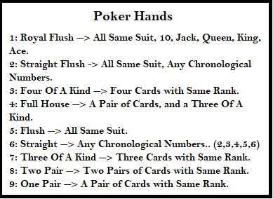

# Poker Fanatic!
## Maximilian Finnican
## 4-18-2018
---
# Abstract

&emsp;The overall objective of Poker Fanatic (PF) is to have a desktop application that can run a game of Five Card Poker against an intelligent AI to teach users strategies and basics of five card poker draw. The project consists of multiple classes and utilizes the JavaFx library to create a standalone application. All the code is written within eclipse oxygen, an IDE that I prefer because of its helpful auto fill options, vast library collections for java, and its debug mode. When developing PF, I first began by creating the deck of cards, using an array List I was able to create a list of 52 “Card” objects to be contained inside my Deck Class. Then I added the player class and opponent class, so it could interact with the deck. Using JavaFx I then was able to create an environment for the player and opponent to play against each other.  
&emsp;	The product that has been developed now has a list of features: Adjustable Opponent (easy, medium, hard), A graphic containing instructions on how to play poker, a graphic containing a ranked list of poker hand combinations, results post due to the points earned by the player and opponent, clickable cards with a nice highlight to see cards clicked, and fun sounds that help navigate and determine results of game. Users can launch the game, choosing the level of difficulty of the computer, deal out cards, make educated decision on cards to give back, and then see their results on the next page. If the user is satisfied with the level of difficulty they can continue to play if not there is an option to go back to the main page in order to change the computers difficulty. 
Keywords: Java, JavaFx, Eclipse, AI, Card Games.

---

# Table of Contents

1. [Abstract](#abstract)
2. [Introduction and Project Overview](#introProOv)
	1. [Problem, Objectives, Users](#pou)
	2. [Background Information](#backgroundInfo)
	3. [Features](#features)
3. [Design, Development, and Test](#ddt)
	1. [Design](#design)
	2. [Development](#dev)
	3. [Testing](#test)
4. [Results](#result)
5. [Conclusion](#conclusion)
6. [References](#ref)
 

---

# Introduction and Project Overview

&emsp;When I was little my grandpa taught me how to play five card poker draws. As I got older my grandfather is no longer with us, but now I have little cousins who do not know how to play Poker! Kids these days are so infatuated with technology I felt if there was one way to teach them how to play poker then it would have to be from the computer. Poker Fanatic is the attempt to create an educational poker game to try and help people learn how to play poker from the comfort of their computer. 

## Problem

&emsp;When people are learning how to play poker the most basic thing to understand is the actual rules of the game. Because there are many combinations of cards inside the game, people tend to not know them all. You need to inform the user that all the cards have different “values”. When looking at an “Ace” vs a “2” in rank they are very different because of the value associated with the card’s rank. An Ace can be counted as 1 or 14, in the case of five card poker draw, PF has Ace programmed as 14 always, although the 2 is always counted as 2. To win in poker the user must know about the effect of having higher ranked cards, meaning if the player has an ace and the opponent has a 2 the player would win, and the opponent would lose. There are also many combinations of cards, flushes, straights, three of kind, pair, royal flush, and etc. All these combinations deal with the cards in the user hand and if they have same suit, are consecutive in ranks, or a combination of both. The ranking of these combinations are based off the rarity of the combination. When poker was created these rarities were decided, creating a ranked order causing other card combinations to be greater than others. The user needs a list of those hand combinations in a ranked order. Once the user knows how to play and what to look for it only takes practice and my goal will have been satistfied.

 

 

 

Figure one &emsp; &emsp; &emsp; &emsp; &emsp; &emsp; Figure two

## Objectives

&emsp;Poker Fanatic is meant to teach someone how to become good at poker. What I wanted to have available for the user is easy ways to start the game, adjustable versions of the game so the user can start at their level of expertise, and feedback to show them what they got based off the combination of cards in their hand. I wanted an intuitive design so that is why when you run the game you immediately know what to do, to solve this the user is prompted with three buttons reading “easy”, “medium”, and “hard” which are also colored green yellow and red for visual ques. When clicked the rules of poker are displayed and a button that says, “deal out cards”. Hopefully by this point the user understands the basics of the game and continues to deal out the cards. Now the user has a bunch of cards and is not sure what to do, so a map of poker hand rankings is displayed to help aid the user’s decisions with what cards to give away. Once you have given back your cards points will be evaluated for your final hand and printed after you flip the opponents hand.  This was implemented to help see the rank of their hand on the ranking list. 

## Users

&emsp;Users of Poker Fanatic would be younger kids, or young adults. This is because most of the elder generations have played poker before and usually prefer using standard cards rather than a computer program.

## Relevant background information

&emsp;Other types of poker apps exist out on the market but not many are focused in on teaching the user how to play the game. Most other versions have gambling aspects with real currencies, multiplayer, and customizable avatars. This adds more fun to the game for the user, but these games are not as educational as poker fanatic.

## Problem Scope

&emsp; My problem scope is will the user be able to start up the application and make educated decisions about his/her moves when prompted to give back cards.

## Summary of Features
| Features|
|----------|
|Adjustable Opponent|
|Adjustable backgrounds and colors|
|Poker hand ranking chart|
|Sounds and Music|
|Card Images|
|Clickable cards to give back|
|Show points earned for poker hand|
|Customizable winning graphics|
|Animation of Cards|

